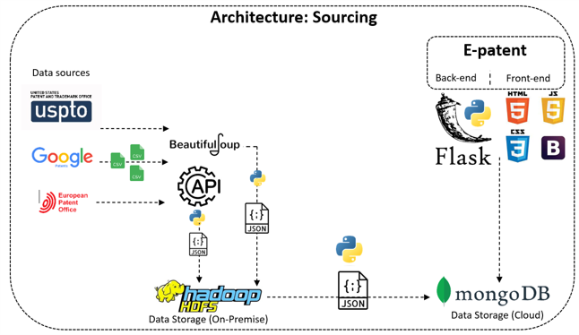
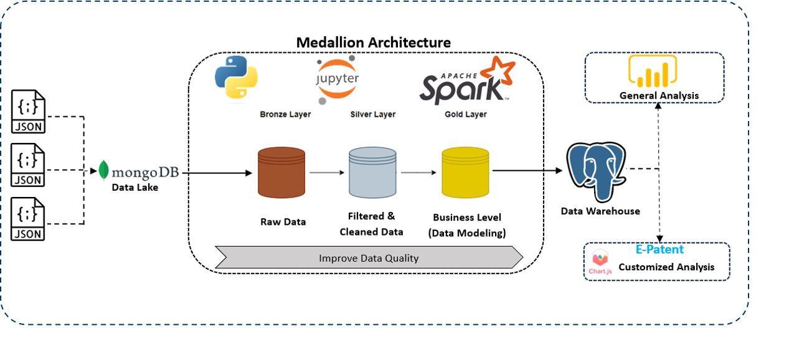
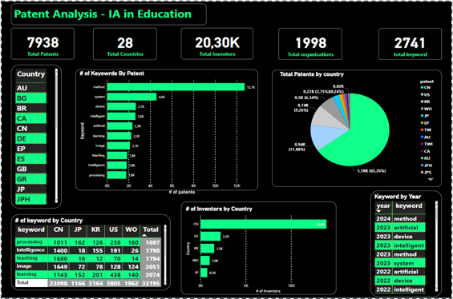
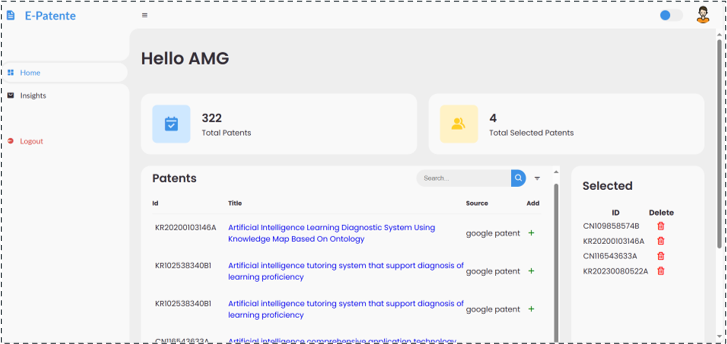

# E-Patent: Big Data Analysis of AI-Related Patents in Education

## Table of Contents

1. [Project Overview](#project-overview)
2. [Technologies Used](#technologies-used)
3. [Project Details](#project-details)
    - [Part 1: Identification of Sources](#part-1-identification-of-sources)
    - [Part 2: Data Collection](#part-2-data-collection)
    - [Part 3: Data Storage](#part-3-data-storage)
    - [Part 4: Data Transformation](#part-4-data-transformation)
    - [Part 5: Data Warehouse](#part-5-data-warehouse)
    - [Part 6: Web Application](#part-6-web-application)
4. [Architecture of Sourcing and Transformation](#architecture-of-sourcing-and-transformation)
5. [Dashboard General with Power BI](#dashboard-general-with-power-bi)
6. [UI of the Web App E-Patent](#ui-of-the-web-app-e-patent)
7. [Demo Video](#demo-video)
8. [Conclusion](#conclusion)
9. [Contacts](#contacts)

## Project Overview

E-Patent is a comprehensive project aimed at analyzing patents related to Artificial Intelligence (AI) in education. Our project involves data collection, storage, transformation, and visualization using various big data technologies and frameworks. The primary goal is to provide personalized and general analyses of patents through a user-friendly web application.

## Technologies Used

- **APIs and Web Scraping:** For data collection from Google Patents, OPS, and USPTO.
- **MongoDB Atlas (Cloud) and HDFS (On-premise):** For data storage.
- **Apache Spark:** For data transformation using the Medallion architecture.
- **PostgreSQL:** For the data warehouse following a star schema.
- **SQLAlchemy (Python):** For ORM to interact with the data warehouse.
- **Flask, JavaScript, HTML, CSS, ChartJS:** For the web application.
- **Power BI:** For creating general dashboards.

## Project Details

### Part 1: Identification of Sources

Sources:
- Google Patents
- OPS (Open Patent Services)
- USPTO (United States Patent and Trademark Office)

### Part 2: Data Collection

Data is collected using APIs and web scraping techniques to gather relevant patent information.

### Part 3: Data Storage

- **MongoDB Atlas (Cloud):** For scalable and flexible data storage.
- **HDFS (On-premise):** For distributed storage of large datasets.

### Part 4: Data Transformation

Using **Apache Spark** to process and transform data through the Medallion architecture:
- **Bronze Layer:** Contains raw data.
- **Silver Layer:** Contains filtered and cleaned data.
- **Gold Layer:** Data modeling and construction of the Data Warehouse (DW).

### Part 5: Data Warehouse

Schema: **Star Schema**

- **PostgreSQL:** Used for the data warehouse.
- **SQLAlchemy (Python):** ORM for seamless interaction with the data warehouse.

### Part 6: Web Application

Technologies:
- **Flask:** Backend framework.
- **JavaScript, HTML, CSS:** Frontend technologies.
- **ChartJS:** For data visualization.

Features:
- **Personalized Patent Search:** Users can perform customized searches on patents.
- **Customized Analysis:** Users can select patents for personalized analysis.
- **General Analysis Dashboard:** Users have access to a dashboard with general analyses of all collected patents.

## Architecture of Sourcing and Transformation

The data sourcing and transformation architecture follows a structured approach to ensure data integrity and usability:

1. **Data Sourcing:** APIs and web scraping to gather raw data.
2. **Data Storage:** Using MongoDB Atlas for cloud storage and HDFS for on-premise storage.

3. **Data Transformation:** Utilizing Apache Spark in a Medallion architecture:
    - **Bronze Layer:** Raw data storage.
    - **Silver Layer:** Cleaned and filtered data.
    - **Gold Layer:** Modeled data for analysis.

## Dashboard General with Power BI

We created general dashboards using **Power BI** to provide insights into the collected patent data. These dashboards include visualizations and metrics that offer a comprehensive view of the dataset.

## UI of the Web App E-Patent

The **E-Patent** web application features an intuitive user interface developed using Flask, JavaScript, HTML, CSS, and ChartJS. The UI allows users to:
- Perform customized patent searches.
- Access personalized and general analyses.
- View interactive data visualizations.

## Demo Video

Watch our demo video to see the E-Patent application in action:
[Demo Video Link](https://youtu.be/leHGDz7AAik?si=qmpUXwlMb9L9KnAw)

## Conclusion

The E-Patent project demonstrates the potential of big data technologies in analyzing and visualizing patents related to AI in education. By leveraging a combination of data collection, transformation, storage, and visualization tools, we have created a comprehensive platform for patent analysis.

## Contacts

For any inquiries or feedback, please contact:
- <a href="https://www.linkedin.com/in/aymane-maghouti/" target="_blank">Aymane Maghouti</a> 
- <a href="https://www.linkedin.com/in/ossama-outmani/" target="_blank">Ossama Outmani</a> 
- <a href="https://www.linkedin.com/in/hamza-motassim-a56801219/" target="_blank">Hamza MOTASSIM</a> 
- <a href="https://www.linkedin.com/in/abdelghafor-elgharbaoui-16a276202/" target="_blank">Aymane Maghouti</a> 
